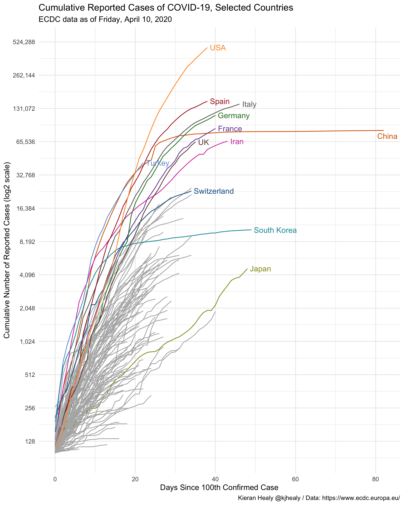
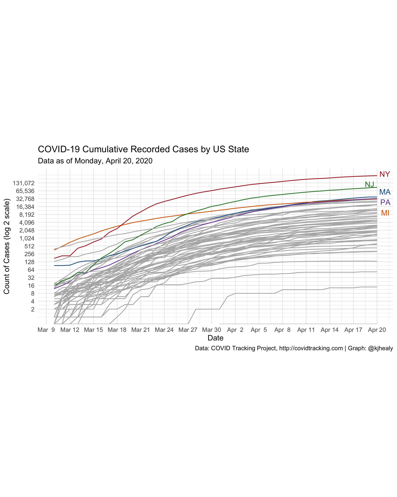

<!-- README.md is generated from README.Rmd. Please edit that file -->


# covdata 

<!-- badges: start -->
[](https://travis-ci.com/kjhealy/covdata)
<!-- badges: end -->

`covdata` is a data package for R. It provides COVID-19 case data from four sources: 

- National level data from the [European Centers for Disease Control](https://www.ecdc.europa.eu/en).  
- State-level data for the United States from the [COVID Tracking Project](https://covidtracking.com). 
- State-level and county-level data for the United States from the [_New York Times_](https://github.com/nytimes/covid-19-data).
- Data from the US Centers for Disease Control's [Coronavirus Disease 2019 (COVID-19)-Associated Hospitalization Surveillance Network](https://www.cdc.gov/coronavirus/2019-ncov/covid-data/covidview/index.html) (COVID-NET). See below for details about this network and the scope of its coverage.

The data are provided as-is. More information about collection methods, scope, limits, and possible sources of error in the data can be found in the documentation provided by their respective sources. (Follow the links above.)


Data are current through Monday, April 13, 2020.

## Installation

There are two ways to install the `covdata` package. 

### Install direct from GitHub

You can install the beta version of congress from [GitHub](https://github.com/kjhealy/congress) with:

``` r
remotes::install_github("kjhealy/covdata")
```

### Installation using `drat`

While using `install_github()` works just fine, it would be nicer to be able to just type `install.packages("covdata")` or `update.packages("covdata")` in the ordinary way. We can do this using Dirk Eddelbuettel's [drat](http://eddelbuettel.github.io/drat/DratForPackageUsers.html) package. Drat provides a convenient way to make R aware of package repositories other than CRAN.

First, install `drat`:


```r
if (!require("drat")) {
    install.packages("drat")
    library("drat")
}
```

Then use `drat` to tell R about the repository where `covdata` is hosted:


```r
drat::addRepo("kjhealy")
```

You can now install `covdata`:


```r
install.packages("covdata")
```

To ensure that the `covdata` repository is always available, you can add the following line to your `.Rprofile` or `.Rprofile.site` file:


```r
drat::addRepo("kjhealy")
```

With that in place you'll be able to do `install.packages("covdata")` or `update.packages("covdata")` and have everything work as you'd expect. 

Note that my drat repository only contains data packages that are not on CRAN, so you will never be in danger of grabbing the wrong version of any other package.

## Loading the Data

### Country-Level Data from the ECDC


```r
library(tidyverse)
library(covdata)

covnat
#> # A tibble: 10,268 x 8
#> # Groups:   iso3 [205]
#>    date       cname       iso3  cases deaths  pop_2018 cu_cases cu_deaths
#>    <date>     <chr>       <chr> <dbl>  <dbl>     <dbl>    <dbl>     <dbl>
#>  1 2019-12-31 Afghanistan AFG       0      0  37172386        0         0
#>  2 2019-12-31 Algeria     DZA       0      0  42228429        0         0
#>  3 2019-12-31 Armenia     ARM       0      0   2951776        0         0
#>  4 2019-12-31 Australia   AUS       0      0  24992369        0         0
#>  5 2019-12-31 Austria     AUT       0      0   8847037        0         0
#>  6 2019-12-31 Azerbaijan  AZE       0      0   9942334        0         0
#>  7 2019-12-31 Bahrain     BHR       0      0   1569439        0         0
#>  8 2019-12-31 Belarus     BLR       0      0   9485386        0         0
#>  9 2019-12-31 Belgium     BEL       0      0  11422068        0         0
#> 10 2019-12-31 Brazil      BRA       0      0 209469333        0         0
#> # … with 10,258 more rows
```

### Draw a log-linear graph of cumulative reported cases


```r
## Libraries for the graphs
library(ggrepel)
library(paletteer)
library(prismatic)

## Convenince "Not in" operator
"%nin%" <- function(x, y) {
  return( !(x %in% y) )
}


## Countries to highlight
focus_cn <- c("CHN", "DEU", "GBR", "USA", "IRN", "JPN",
              "KOR", "ITA", "FRA", "ESP", "CHE", "TUR")

## Colors
cgroup_cols <- c(clr_darken(paletteer_d("ggsci::category20_d3"), 0.2)[1:length(focus_cn)], "gray70")

covnat %>%
  filter(cu_cases > 99) %>%
  mutate(days_elapsed = date - min(date),
        end_label = ifelse(date == max(date), cname, NA),
        end_label = recode(end_label, `United States` = "USA",
                            `Iran, Islamic Republic of` = "Iran",
                            `Korea, Republic of` = "South Korea",
                            `United Kingdom` = "UK"),
         cname = recode(cname, `United States` = "USA",
                        `Iran, Islamic Republic of` = "Iran",
                        `Korea, Republic of` = "South Korea",
                        `United Kingdom` = "UK"),
         end_label = case_when(iso3 %in% focus_cn ~ end_label,
                               TRUE ~ NA_character_), 
         cgroup = case_when(iso3 %in% focus_cn ~ iso3, 
                            TRUE ~ "ZZOTHER")) %>%
  ggplot(mapping = aes(x = days_elapsed, y = cu_cases, 
         color = cgroup, label = end_label, 
         group = cname)) + 
  geom_line(size = 0.5) + 
  geom_text_repel(nudge_x = 0.75,
                  segment.color = NA) + 
  guides(color = FALSE) + 
  scale_color_manual(values = cgroup_cols) +
  scale_y_continuous(labels = scales::comma_format(accuracy = 1), 
                     breaks = 2^seq(4, 19, 1),
                     trans = "log2") + 
  labs(x = "Days Since 100th Confirmed Case", 
       y = "Cumulative Number of Reported Cases (log2 scale)", 
       title = "Cumulative Reported Cases of COVID-19, Selected Countries", 
       subtitle = paste("ECDC data as of", format(max(covnat$date), "%A, %B %e, %Y")), 
       caption = "Kieran Healy @kjhealy / Data: https://www.ecdc.europa.eu/") +
  theme_minimal()
#> Don't know how to automatically pick scale for object of type difftime. Defaulting to continuous.
#> Warning: Removed 3018 rows containing missing values (geom_text_repel).
```




### State-Level Data from the COVID Tracking Project


```r
covus
#> # A tibble: 28,784 x 11
#>    date       state fips  measure count pos_neg death_increase hospitalized_in… negative_increa… positive_increa…
#>    <date>     <chr> <chr> <chr>   <dbl>   <dbl>          <dbl>            <dbl>            <dbl>            <dbl>
#>  1 2020-04-11 AK    02    positi…   257    7732              1                3              289               11
#>  2 2020-04-11 AK    02    negati…  7475    7732              1                3              289               11
#>  3 2020-04-11 AK    02    pending    NA    7732              1                3              289               11
#>  4 2020-04-11 AK    02    hospit…    NA    7732              1                3              289               11
#>  5 2020-04-11 AK    02    hospit…    31    7732              1                3              289               11
#>  6 2020-04-11 AK    02    in_icu…    NA    7732              1                3              289               11
#>  7 2020-04-11 AK    02    in_icu…    NA    7732              1                3              289               11
#>  8 2020-04-11 AK    02    on_ven…    NA    7732              1                3              289               11
#>  9 2020-04-11 AK    02    on_ven…    NA    7732              1                3              289               11
#> 10 2020-04-11 AK    02    recove…    63    7732              1                3              289               11
#> # … with 28,774 more rows, and 1 more variable: total_test_results_increase <dbl>
```

### Draw a log-linear graph of cumulative reported US cases


```r
## Which n states are leading the count of positive cases or deaths?
top_n_states <- function(data, n = 5, measure = c("positive", "death")) {
  meas <- match.arg(measure)
  data %>%
  group_by(state) %>%
  filter(measure == meas, date == max(date)) %>%
  drop_na() %>%
  ungroup() %>%
  top_n(n, wt = count) %>%
  pull(state)
}

state_cols <- c("gray70", 
                prismatic::clr_darken(paletteer_d("ggsci::category20_d3"), 0.2))

covus %>%
  group_by(state) %>%
  mutate(core = case_when(state %nin% top_n_states(covus) ~ "",
                          TRUE ~ state),
         end_label = ifelse(date == max(date), core, NA)) %>%
  arrange(date) %>%
  filter(measure == "positive", date > "2020-03-09") %>%
  ggplot(aes(x = date, y = count, group = state, color = core, label = end_label)) + 
  geom_line(size = 0.5) + 
  geom_text_repel(segment.color = NA, nudge_x = 0.2, nudge_y = 0.1) + 
  scale_color_manual(values = state_cols) + 
  scale_x_date(date_breaks = "3 days", date_labels = "%b %e" ) + 
  scale_y_continuous(trans = "log2",
                     labels = scales::comma_format(accuracy = 1),
                     breaks = 2^c(seq(1, 17, 1))) +
  guides(color = FALSE) + 
  coord_equal() + 
  labs(title = "COVID-19 Cumulative Recorded Cases by US State",
       subtitle = paste("Data as of", format(max(covus$date), "%A, %B %e, %Y")),
       x = "Date", y = "Count of Cases (log 2 scale)", 
       caption = "Data: COVID Tracking Project, http://covidtracking.com | Graph: @kjhealy") + 
  theme_minimal()
#> Warning: Transformation introduced infinite values in continuous y-axis

#> Warning: Transformation introduced infinite values in continuous y-axis
#> Warning: Removed 15 row(s) containing missing values (geom_path).
#> Warning: Removed 1762 rows containing missing values (geom_text_repel).
```




### State-Level and County-Level (Cumulative) Data from the _New York Times_


```r
nytcovstate
#> # A tibble: 2,105 x 5
#>    date       state      fips  cases deaths
#>    <date>     <chr>      <chr> <dbl>  <dbl>
#>  1 2020-01-21 Washington 53        1      0
#>  2 2020-01-22 Washington 53        1      0
#>  3 2020-01-23 Washington 53        1      0
#>  4 2020-01-24 Illinois   17        1      0
#>  5 2020-01-24 Washington 53        1      0
#>  6 2020-01-25 California 06        1      0
#>  7 2020-01-25 Illinois   17        1      0
#>  8 2020-01-25 Washington 53        1      0
#>  9 2020-01-26 Arizona    04        1      0
#> 10 2020-01-26 California 06        2      0
#> # … with 2,095 more rows
```


```r
nytcovcounty
#> # A tibble: 45,880 x 6
#>    date       county      state      fips  cases deaths
#>    <date>     <chr>       <chr>      <chr> <dbl>  <dbl>
#>  1 2020-01-21 Snohomish   Washington 53061     1      0
#>  2 2020-01-22 Snohomish   Washington 53061     1      0
#>  3 2020-01-23 Snohomish   Washington 53061     1      0
#>  4 2020-01-24 Cook        Illinois   17031     1      0
#>  5 2020-01-24 Snohomish   Washington 53061     1      0
#>  6 2020-01-25 Orange      California 06059     1      0
#>  7 2020-01-25 Cook        Illinois   17031     1      0
#>  8 2020-01-25 Snohomish   Washington 53061     1      0
#>  9 2020-01-26 Maricopa    Arizona    04013     1      0
#> 10 2020-01-26 Los Angeles California 06037     1      0
#> # … with 45,870 more rows
```

### Draw a log-linear graph of cumulative US cases by county


```r
nytcovcounty %>%
  mutate(uniq_name = paste(county, state)) %>% # Can't use FIPS because of how the NYT bundled cities
  group_by(uniq_name) %>%
  mutate(days_elapsed = date - min(date)) %>%
  ggplot(aes(x = days_elapsed, y = cases, group = uniq_name)) + 
  geom_line(size = 0.25, color = "gray20") + 
  scale_y_log10(labels = scales::label_number_si()) + 
  guides(color = FALSE) + 
  facet_wrap(~ state, ncol = 5) + 
  labs(title = "COVID-19 Cumulative Recorded Cases by US County",
       subtitle = paste("New York is bundled into a single area in this data.\nData as of", format(max(nytcovcounty$date), "%A, %B %e, %Y")),
       x = "Days since first case", y = "Count of Cases (log 10 scale)", 
       caption = "Data: The New York Times | Graph: @kjhealy") + 
  theme_minimal()
#> Don't know how to automatically pick scale for object of type difftime. Defaulting to continuous.
#> Warning: Transformation introduced infinite values in continuous y-axis
```


### US CDC Surveillance Network Data
This US Centers for Disase Control surveillance network conducts population-based surveillance for laboratory-confirmed COVID-19-associated hospitalizations in children (persons younger than 18 years) and adults in the United States. The current network covers nearly 100 counties in the 10 Emerging Infections Program (EIP) states (CA, CO, CT, GA, MD, MN, NM, NY, OR, and TN) and four additional states through the Influenza Hospitalization Surveillance Project (IA, MI, OH, and UT). The network represents approximately 10% of US population (~32 million people).  Cases are identified by reviewing hospital, laboratory, and admission databases and infection control logs for
patients hospitalized with a documented positive SARS-CoV-2 test. Data gathered are used to estimate
age-specific hospitalization rates on a weekly basis and describe characteristics of persons
hospitalized with COVID-19. Laboratory confirmation is dependent on clinician-ordered SARS-CoV-2
testing. Therefore, the unadjusted rates provided are likely to be underestimated as
COVID-19-associated hospitalizations can be missed due to test availability and provider or facility
testing practices.  COVID-NET hospitalization data are preliminary and subject to change as more data
become available. All incidence rates are unadjusted. Please use the following citation when
referencing these data: “COVID-NET: COVID-19-Associated Hospitalization Surveillance Network, Centers
for Disease Control and Prevention. WEBSITE. Accessed on DATE”.

Thanks to Bob Rudis's [`cdccovidview`](https://github.com/hrbrmstr/cdccovidview) package for making these data tractable to include. 


```r
cdc_hospitalizations
#> # A tibble: 4,590 x 8
#>    catchment      network   year  mmwr_year mmwr_week age_category cumulative_rate weekly_rate
#>    <chr>          <chr>     <chr> <chr>     <chr>     <chr>                  <dbl>       <dbl>
#>  1 Entire Network COVID-NET 2020  2020      10        0-4 yr                   0           0  
#>  2 Entire Network COVID-NET 2020  2020      11        0-4 yr                   0           0  
#>  3 Entire Network COVID-NET 2020  2020      12        0-4 yr                   0           0  
#>  4 Entire Network COVID-NET 2020  2020      13        0-4 yr                   0.3         0.3
#>  5 Entire Network COVID-NET 2020  2020      14        0-4 yr                   0.6         0.3
#>  6 Entire Network COVID-NET 2020  2020      15        0-4 yr                  NA          NA  
#>  7 Entire Network COVID-NET 2020  2020      16        0-4 yr                  NA          NA  
#>  8 Entire Network COVID-NET 2020  2020      17        0-4 yr                  NA          NA  
#>  9 Entire Network COVID-NET 2020  2020      18        0-4 yr                  NA          NA  
#> 10 Entire Network COVID-NET 2020  2020      19        0-4 yr                  NA          NA  
#> # … with 4,580 more rows

cdc_catchments
#> # A tibble: 17 x 2
#>    name      area          
#>  * <chr>     <chr>         
#>  1 COVID-NET Entire Network
#>  2 EIP       California    
#>  3 EIP       Colorado      
#>  4 EIP       Connecticut   
#>  5 EIP       Entire Network
#>  6 EIP       Georgia       
#>  7 EIP       Maryland      
#>  8 EIP       Minnesota     
#>  9 EIP       New Mexico    
#> 10 EIP       New York      
#> 11 EIP       Oregon        
#> 12 EIP       Tennessee     
#> 13 IHSP      Entire Network
#> 14 IHSP      Iowa          
#> 15 IHSP      Michigan      
#> 16 IHSP      Ohio          
#> 17 IHSP      Utah

cdc_deaths_by_state
#> # A tibble: 53 x 7
#>    state      covid_deaths total_deaths percent_expected_d… pneumonia_deaths pneumonia_and_cov… all_influenza_deat…
#>    <chr>             <int>        <int>               <dbl>            <int>              <int>               <int>
#>  1 Alabama              14         9220                0.87              539                  4                  75
#>  2 Alaska                1          627                0.75               31                  1                   3
#>  3 Arizona              26        11862                0.97              748                 13                  95
#>  4 Arkansas              3         5938                0.92              372                  2                  62
#>  5 California          175        52505                0.94             4170                 96                 511
#>  6 Colorado             62         7787                0.98              493                 33                  77
#>  7 Connectic…            0            0                0                   0                  0                   0
#>  8 Delaware              1         1333                0.71               65                  1                   9
#>  9 District …            4         1074                0.88               91                  4                   5
#> 10 Florida             145        41586                0.97             2722                 83                 249
#> # … with 43 more rows

nssp_covid_er_reg
#> # A tibble: 538 x 9
#>     week num_fac total_ed_visits visits pct_visits visit_type region   source                 year
#>    <int>   <int> <chr>            <int>      <dbl> <chr>      <chr>    <chr>                 <int>
#>  1    41     202 130377             814    0.006   ili        Region 1 Emergency Departments  2019
#>  2    42     202 132385             912    0.00700 ili        Region 1 Emergency Departments  2019
#>  3    43     202 131866             883    0.00700 ili        Region 1 Emergency Departments  2019
#>  4    44     203 128256             888    0.00700 ili        Region 1 Emergency Departments  2019
#>  5    45     203 127466             979    0.008   ili        Region 1 Emergency Departments  2019
#>  6    46     202 125306            1188    0.009   ili        Region 1 Emergency Departments  2019
#>  7    47     202 128877            1235    0.01    ili        Region 1 Emergency Departments  2019
#>  8    48     202 124781            1451    0.012   ili        Region 1 Emergency Departments  2019
#>  9    49     202 125939            1362    0.011   ili        Region 1 Emergency Departments  2019
#> 10    50     202 130430            1405    0.011   ili        Region 1 Emergency Departments  2019
#> # … with 528 more rows
```


```r

age_f <- c(
  "0-4 yr", "5-17 yr", "18-49 yr", 
  "50-64 yr", "65+ yr", "65-74 yr", 
  "75-84 yr", "85+")

cdc_hospitalizations %>%
  mutate(start = cdccovidview::mmwr_week_to_date(mmwr_year, mmwr_week)) %>% 
  filter(!is.na(weekly_rate)) %>% 
  filter(catchment == "Entire Network") %>% 
  select(start, network, age_category, weekly_rate) %>%  
  filter(age_category != "Overall") %>% 
  mutate(age_category = factor(age_category, levels = age_f)) %>% 
  ggplot() +
  geom_line(aes(start, weekly_rate)) +
  scale_x_date(
    date_breaks = "2 weeks", date_labels = "%b\n%d"
  ) +
  facet_grid(network ~ age_category) +
  labs(x = NULL, y = "Rates per 100,000 pop",
    title = "COVID-NET Weekly Rates by Network and Age Group",
    subtitle = "Courtesy Bob Rudis's cdccovidview",
    caption = sprintf("Source: COVID-NET: COVID-19-Associated Hospitalization Surveillance Network, Centers for Disease Control and Prevention.\n<https://gis.cdc.gov/grasp/COVIDNet/COVID19_3.html>; Accessed on %s", Sys.Date())) +
  theme_minimal()
```


### Citing the package


```r
citation("covdata")
#> 
#> To cite the package `covdata` in publications use:
#> 
#>   Kieran Healy. 2020. covdata: COVID-19 Case and Mortality Time Series. R package version 0.1.0,
#>   <http://kjhealy.github.io/covdata>.
#> 
#> A BibTeX entry for LaTeX users is
#> 
#>   @Manual{,
#>     title = {covdata: COVID-19 Case and Mortality Time Series},
#>     author = {Kieran Healy},
#>     year = {2020},
#>     note = {R package version 0.1.0},
#>     url = {http://kjhealy.github.io/covdata},
#>   }
```


Mask icon in hex logo by [Freepik](https://www.flaticon.com/authors/freepik).
