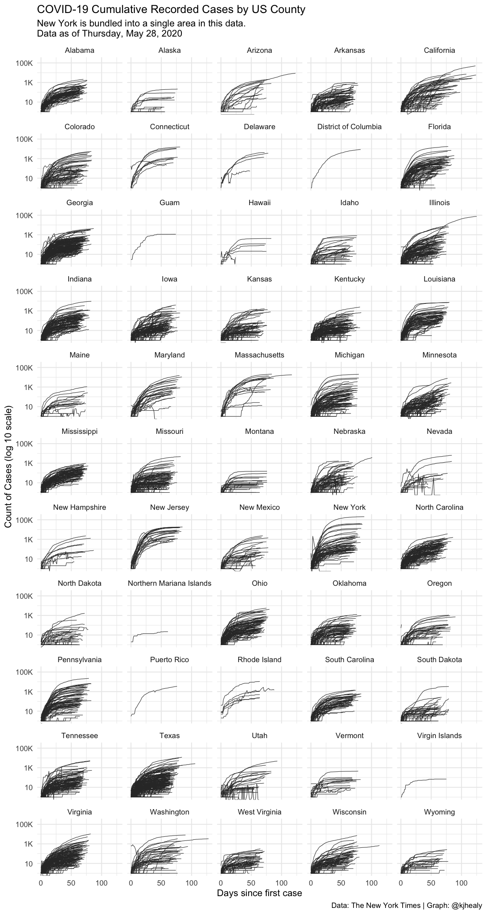

<!-- README.md is generated from README.Rmd. Please edit that file -->


# covdata 

<!-- badges: start -->
[](https://github.com/kjhealy/covdata/actions)
<!-- badges: end -->

## About the package

`covdata` is a data package for R that collects and bundles datasets related to [the COVID-19 pandemic](https://www.who.int/emergencies/diseases/novel-coronavirus-2019) from a variety of sources. The data are current as of Tuesday, June 30, 2020. Minimal post-processing of the data has been done in comparison to the original sources, beyond conversion to [tibbles](https://tibble.tidyverse.org) and transformation into [narrow](https://en.wikipedia.org/wiki/Wide_and_narrow_data)- or [tidy](https://en.wikipedia.org/wiki/Tidy_data) form. Occasionally some additional variables have been added (mostly [ISO country codes](https://en.wikipedia.org/wiki/ISO_3166-1)) to facilitate comparison across the datasets or their integration with other sources. 

`covdata` provides the following: 

### COVID-19 specific case and mortality data

- National-level case and mortality data from the [European Centers for Disease Control](https://www.ecdc.europa.eu/en).  
- State-level case and mortality data for the United States from the [COVID Tracking Project](https://covidtracking.com). 
- State-level and county-level case and mortality data for the United States from the [_New York Times_](https://github.com/nytimes/covid-19-data).
- Data from the US Centers for Disease Control's [Coronavirus Disease 2019 (COVID-19)-Associated Hospitalization Surveillance Network](https://www.cdc.gov/coronavirus/2019-ncov/covid-data/covidview/index.html) (COVID-NET). See below for details about this network and the scope of its coverage.

### All-cause mortality and excess mortality data

- National-level short-term mortality fluctuations data from the [Human Mortality Database](https://www.mortality.org).
- National-level all-cause and excess mortality estimates from the [_New York Times_](https://github.com/nytimes/covid-19-data).  

### Mobility and activity data

- Data from [Apple](http://apple.com/covid19) on relative trends in mobility in cities and countries since mid-January of 2020, based on usage of their Maps application.
- Data from [Google](https://www.google.com/covid19/mobility/data_documentation.html) on relative trends in mobility in regions and countries since mid-January of 2020, based on location and activity information.

### Policy data

- Data on policy interventions from the [CoronaNet Project](https://coronanet-project.org), providing event-based tracking of governmental policy responses to COVID-19. 

## Caveat Emptor

**The data are provided as-is**. More information about collection methods, scope, limits, and possible sources of error in the data can be found in the documentation provided by their respective sources. Follow the links above, and see the vignettes in the package. The collection and effective reporting of case and mortality data by national governments has technical and political aspects influenced by, amongst other things, the varying capacity of states to test, track and measure events in a timely fashion, the varying definitions, criteria, and methods employed by states in registering cases and deaths, and the role of politics in the exercise of capacity and the reporting of unflattering news. Researchers should take care to familiarize themselves with these issues prior to making strong claims based on these data.

## Installation

There are two ways to install the `covdata` package. 

### Install direct from GitHub

You can install covdata from [GitHub](https://github.com/kjhealy/covdata) with:

``` r
remotes::install_github("kjhealy/covdata")
```

### Installation using `drat`

While using `install_github()` works just fine, it would be nicer to be able to just type `install.packages("covdata")` or `update.packages("covdata")` in the ordinary way. We can do this using Dirk Eddelbuettel's [drat](http://eddelbuettel.github.io/drat/DratForPackageUsers.html) package. Drat provides a convenient way to make R aware of package repositories other than CRAN.

First, install `drat`:


```r
if (!require("drat")) {
    install.packages("drat")
    library("drat")
}
```

Then use `drat` to tell R about the repository where `covdata` is hosted:


```r
drat::addRepo("kjhealy")
```

You can now install `covdata`:


```r
install.packages("covdata")
```

To ensure that the `covdata` repository is always available, you can add the following line to your `.Rprofile` or `.Rprofile.site` file:


```r
drat::addRepo("kjhealy")
```

With that in place you'll be able to do `install.packages("covdata")` or `update.packages("covdata")` and have everything work as you'd expect. 

Note that my drat repository only contains data packages that are not on CRAN, so you will never be in danger of grabbing the wrong version of any other package.

## Loading the Data


```r
library(tidyverse) # Optional but strongly recommended
library(covdata)

covnat
#> # A tibble: 23,782 x 8
#> # Groups:   iso3 [209]
#>    date       cname       iso3  cases deaths  pop_2018 cu_cases cu_deaths
#>    <date>     <chr>       <chr> <dbl>  <dbl>     <dbl>    <dbl>     <dbl>
#>  1 2019-12-31 Afghanistan AFG       0      0  37172386        0         0
#>  2 2019-12-31 Algeria     DZA       0      0  42228429        0         0
#>  3 2019-12-31 Armenia     ARM       0      0   2951776        0         0
#>  4 2019-12-31 Australia   AUS       0      0  24992369        0         0
#>  5 2019-12-31 Austria     AUT       0      0   8847037        0         0
#>  6 2019-12-31 Azerbaijan  AZE       0      0   9942334        0         0
#>  7 2019-12-31 Bahrain     BHR       0      0   1569439        0         0
#>  8 2019-12-31 Belarus     BLR       0      0   9485386        0         0
#>  9 2019-12-31 Belgium     BEL       0      0  11422068        0         0
#> 10 2019-12-31 Brazil      BRA       0      0 209469333        0         0
#> # … with 23,772 more rows
```


```r
apple_mobility %>%
  filter(region == "New York City", transportation_type == "walking")
#> # A tibble: 168 x 8
#>    geo_type region        transportation_type alternative_name sub_region country       date       index
#>    <chr>    <chr>         <chr>               <chr>            <chr>      <chr>         <date>     <dbl>
#>  1 city     New York City walking             NYC              New York   United States 2020-01-13 100  
#>  2 city     New York City walking             NYC              New York   United States 2020-01-14  96.1
#>  3 city     New York City walking             NYC              New York   United States 2020-01-15 106. 
#>  4 city     New York City walking             NYC              New York   United States 2020-01-16 102. 
#>  5 city     New York City walking             NYC              New York   United States 2020-01-17 117. 
#>  6 city     New York City walking             NYC              New York   United States 2020-01-18 115. 
#>  7 city     New York City walking             NYC              New York   United States 2020-01-19 110. 
#>  8 city     New York City walking             NYC              New York   United States 2020-01-20  88.6
#>  9 city     New York City walking             NYC              New York   United States 2020-01-21  91.1
#> 10 city     New York City walking             NYC              New York   United States 2020-01-22  98.5
#> # … with 158 more rows
```


```r
covus %>% 
  filter(measure == "positive", 
         date == "2020-04-27", 
         state == "NJ")
#> # A tibble: 1 x 7
#>   date       state fips  data_quality_grade measure   count measure_label 
#>   <date>     <chr> <chr> <chr>              <chr>     <dbl> <chr>         
#> 1 2020-04-27 NJ    34    A                  positive 111188 Positive Tests
```


```r
nytcovcounty %>%
  mutate(uniq_name = paste(county, state)) %>% # Can't use FIPS because of how the NYT bundled cities
  group_by(uniq_name) %>%
  mutate(days_elapsed = date - min(date)) %>%
  ggplot(aes(x = days_elapsed, y = cases, group = uniq_name)) + 
  geom_line(size = 0.25, color = "gray20") + 
  scale_y_log10(labels = scales::label_number_si()) + 
  guides(color = FALSE) + 
  facet_wrap(~ state, ncol = 5) + 
  labs(title = "COVID-19 Cumulative Recorded Cases by US County",
       subtitle = paste("New York is bundled into a single area in this data.\nData as of", format(max(nytcovcounty$date), "%A, %B %e, %Y")),
       x = "Days since first case", y = "Count of Cases (log 10 scale)", 
       caption = "Data: The New York Times | Graph: @kjhealy") + 
  theme_minimal()
#> Don't know how to automatically pick scale for object of type difftime. Defaulting to continuous.
#> Warning: Transformation introduced infinite values in continuous y-axis
```




To learn more about the different datasets available, consult the vignettes or, equivalently, the [the package website](https://kjhealy.github.io/covdata/articles/covdata.html). 

## Overview of Included Tables

Here is an overview of the contents of each table of data in the package. For further details on the variables, consult each table's help page.

### National-level case and mortality data from the [European Centers for Disease Control](https://www.ecdc.europa.eu/en)


```r
covnat %>%
  ungroup() %>%
  skimr::skim()
```


|                         |           |
|:------------------------|:----------|
|Name                     |Piped data |
|Number of rows           |23782      |
|Number of columns        |8          |
|_______________________  |           |
|Column type frequency:   |           |
|character                |2          |
|Date                     |1          |
|numeric                  |5          |
|________________________ |           |
|Group variables          |None       |


**Variable type: character**

|skim_variable | n_missing| complete_rate| min| max| empty| n_unique| whitespace|
|:-------------|---------:|-------------:|---:|---:|-----:|--------:|----------:|
|cname         |         0|             1|   4|  42|     0|      209|          0|
|iso3          |         0|             1|   3|   3|     0|      209|          0|


**Variable type: Date**

|skim_variable | n_missing| complete_rate|min        |max        |median     | n_unique|
|:-------------|---------:|-------------:|:----------|:----------|:----------|--------:|
|date          |         0|             1|2019-12-31 |2020-06-16 |2020-04-20 |      169|


**Variable type: numeric**

|skim_variable | n_missing| complete_rate|        mean|           sd|    p0|     p25|     p50|        p75|       p100|hist  |
|:-------------|---------:|-------------:|-----------:|------------:|-----:|-------:|-------:|----------:|----------:|:-----|
|cases         |         0|          1.00|      336.40|      1905.03| -2461|       0|       3|       58.0|      48529|▇▁▁▁▁ |
|deaths        |         0|          1.00|       18.36|       121.38| -1918|       0|       0|        1.0|       4928|▁▇▁▁▁ |
|pop_2018      |       371|          0.98| 48080389.06| 168180695.01|  1000| 2082958| 9485386| 31989256.0| 1392730000|▇▁▁▁▁ |
|cu_cases      |         0|          1.00|    13595.15|     85543.30|     0|      11|     174|     2000.5|    2114026|▇▁▁▁▁ |
|cu_deaths     |         0|          1.00|      853.97|      5535.00|     0|       0|       3|       47.0|     116127|▇▁▁▁▁ |


### State-level case and mortality data for the United States from the [COVID Tracking Project](https://covidtracking.com)


```r
skimr::skim(covus)
```


|                         |      |
|:------------------------|:-----|
|Name                     |covus |
|Number of rows           |97695 |
|Number of columns        |7     |
|_______________________  |      |
|Column type frequency:   |      |
|character                |5     |
|Date                     |1     |
|numeric                  |1     |
|________________________ |      |
|Group variables          |None  |


**Variable type: character**

|skim_variable      | n_missing| complete_rate| min| max| empty| n_unique| whitespace|
|:------------------|---------:|-------------:|---:|---:|-----:|--------:|----------:|
|state              |         0|          1.00|   2|   2|     0|       56|          0|
|fips               |         0|          1.00|   2|   2|     0|       56|          0|
|data_quality_grade |     16515|          0.83|   1|   2|     0|        6|          0|
|measure            |         0|          1.00|   5|  24|     0|       15|          0|
|measure_label      |         0|          1.00|   6|  54|     0|       15|          0|


**Variable type: Date**

|skim_variable | n_missing| complete_rate|min        |max        |median     | n_unique|
|:-------------|---------:|-------------:|:----------|:----------|:----------|--------:|
|date          |         0|             1|2020-01-22 |2020-06-29 |2020-05-02 |      160|


**Variable type: numeric**

|skim_variable | n_missing| complete_rate|     mean|       sd| p0| p25|  p50|   p75|    p100|hist  |
|:-------------|---------:|-------------:|--------:|--------:|--:|---:|----:|-----:|-------:|:-----|
|count         |     56300|          0.42| 49548.66| 197741.7|  0| 160| 1293| 15963| 4061692|▇▁▁▁▁ |


### State-level and county-level case and mortality data for the United States from the [_New York Times_](https://github.com/nytimes/covid-19-data)


```r
skimr::skim(nytcovcounty)
```


|                         |             |
|:------------------------|:------------|
|Name                     |nytcovcounty |
|Number of rows           |279450       |
|Number of columns        |6            |
|_______________________  |             |
|Column type frequency:   |             |
|character                |3            |
|Date                     |1            |
|numeric                  |2            |
|________________________ |             |
|Group variables          |None         |


**Variable type: character**

|skim_variable | n_missing| complete_rate| min| max| empty| n_unique| whitespace|
|:-------------|---------:|-------------:|---:|---:|-----:|--------:|----------:|
|county        |         0|          1.00|   3|  33|     0|     1805|          0|
|state         |         0|          1.00|   4|  24|     0|       55|          0|
|fips          |      2916|          0.99|   5|   5|     0|     3042|          0|


**Variable type: Date**

|skim_variable | n_missing| complete_rate|min        |max        |median     | n_unique|
|:-------------|---------:|-------------:|:----------|:----------|:----------|--------:|
|date          |         0|             1|2020-01-21 |2020-06-28 |2020-05-13 |      160|


**Variable type: numeric**

|skim_variable | n_missing| complete_rate|   mean|      sd| p0| p25| p50| p75|   p100|hist  |
|:-------------|---------:|-------------:|------:|-------:|--:|---:|---:|---:|------:|:-----|
|cases         |         0|             1| 451.39| 3930.15|  0|   6|  26| 125| 219481|▇▁▁▁▁ |
|deaths        |         0|             1|  24.87|  347.61|  0|   0|   0|   4|  21940|▇▁▁▁▁ |


```r
skimr::skim(nytcovstate)
```


|                         |            |
|:------------------------|:-----------|
|Name                     |nytcovstate |
|Number of rows           |6504        |
|Number of columns        |5           |
|_______________________  |            |
|Column type frequency:   |            |
|character                |2           |
|Date                     |1           |
|numeric                  |2           |
|________________________ |            |
|Group variables          |None        |


**Variable type: character**

|skim_variable | n_missing| complete_rate| min| max| empty| n_unique| whitespace|
|:-------------|---------:|-------------:|---:|---:|-----:|--------:|----------:|
|state         |         0|             1|   4|  24|     0|       55|          0|
|fips          |         0|             1|   2|   2|     0|       55|          0|


**Variable type: Date**

|skim_variable | n_missing| complete_rate|min        |max        |median     | n_unique|
|:-------------|---------:|-------------:|:----------|:----------|:----------|--------:|
|date          |         0|             1|2020-01-21 |2020-06-28 |2020-04-30 |      160|


**Variable type: numeric**

|skim_variable | n_missing| complete_rate|     mean|       sd| p0| p25|  p50|      p75|   p100|hist  |
|:-------------|---------:|-------------:|--------:|--------:|--:|---:|----:|--------:|------:|:-----|
|cases         |         0|             1| 19400.43| 45620.63|  1| 409| 3681| 17790.50| 397293|▇▁▁▁▁ |
|deaths        |         0|             1|  1068.79|  3303.36|  0|   6|  102|   672.25|  31137|▇▁▁▁▁ |


```r
skimr::skim(nytcovus)
```


|                         |         |
|:------------------------|:--------|
|Name                     |nytcovus |
|Number of rows           |160      |
|Number of columns        |3        |
|_______________________  |         |
|Column type frequency:   |         |
|Date                     |1        |
|numeric                  |2        |
|________________________ |         |
|Group variables          |None     |


**Variable type: Date**

|skim_variable | n_missing| complete_rate|min        |max        |median     | n_unique|
|:-------------|---------:|-------------:|:----------|:----------|:----------|--------:|
|date          |         0|             1|2020-01-21 |2020-06-28 |2020-04-09 |      160|


**Variable type: numeric**

|skim_variable | n_missing| complete_rate|      mean|        sd| p0|  p25|      p50|        p75|    p100|hist  |
|:-------------|---------:|-------------:|---------:|---------:|--:|----:|--------:|----------:|-------:|:-----|
|cases         |         0|             1| 788627.41| 844146.64|  1| 83.5| 482645.0| 1542137.00| 2564681|▇▂▂▂▂ |
|deaths        |         0|             1|  43446.26|  47329.43|  0|  2.5|  19952.5|   92303.25|  125814|▇▁▁▂▃ |


### Data from the CDC's [COVID-NET](https://www.cdc.gov/coronavirus/2019-ncov/covid-data/covidview/index.html) 

_CDC Catchment Areas_


```r
skimr::skim(cdc_catchments)
```


|                         |               |
|:------------------------|:--------------|
|Name                     |cdc_catchments |
|Number of rows           |17             |
|Number of columns        |2              |
|_______________________  |               |
|Column type frequency:   |               |
|character                |2              |
|________________________ |               |
|Group variables          |None           |


**Variable type: character**

|skim_variable | n_missing| complete_rate| min| max| empty| n_unique| whitespace|
|:-------------|---------:|-------------:|---:|---:|-----:|--------:|----------:|
|name          |         0|             1|   3|   9|     0|        3|          0|
|area          |         0|             1|   4|  14|     0|       15|          0|


_Deaths by Age_


```r
skimr::skim(cdc_deaths_by_age)
```


|                         |                  |
|:------------------------|:-----------------|
|Name                     |cdc_deaths_by_age |
|Number of rows           |12                |
|Number of columns        |10                |
|_______________________  |                  |
|Column type frequency:   |                  |
|character                |1                 |
|Date                     |3                 |
|numeric                  |6                 |
|________________________ |                  |
|Group variables          |None              |


**Variable type: character**

|skim_variable | n_missing| complete_rate| min| max| empty| n_unique| whitespace|
|:-------------|---------:|-------------:|---:|---:|-----:|--------:|----------:|
|age_group     |         0|             1|   5|  10|     0|       12|          0|


**Variable type: Date**

|skim_variable | n_missing| complete_rate|min        |max        |median     | n_unique|
|:-------------|---------:|-------------:|:----------|:----------|:----------|--------:|
|data_as_of    |         0|             1|2020-04-30 |2020-04-30 |2020-04-30 |        1|
|start_week    |         0|             1|2020-02-01 |2020-02-01 |2020-02-01 |        1|
|end_week      |         0|             1|2020-04-25 |2020-04-25 |2020-04-25 |        1|


**Variable type: numeric**

|skim_variable                | n_missing| complete_rate|      mean|        sd|     p0|     p25|      p50|       p75|      p100|hist  |
|:----------------------------|---------:|-------------:|---------:|---------:|------:|-------:|--------:|---------:|---------:|:-----|
|covid_deaths                 |         0|             1|   5753.50|   9877.31|   2.00|   30.25|  1211.50|   7918.25|  34521.00|▇▃▁▁▁ |
|total_deaths                 |         0|             1| 118897.67| 202377.07| 712.00| 5675.25| 28460.00| 149341.50| 713386.00|▇▂▁▁▁ |
|percent_expected_deaths      |         0|             1|      0.97|      0.00|   0.97|    0.97|     0.97|      0.97|      0.97|▁▁▇▁▁ |
|pneumonia_deaths             |         0|             1|  10454.17|  18036.25|  33.00|  109.00|  1799.50|  14114.25|  62725.00|▇▃▁▁▁ |
|pneumonia_and_covid_deaths   |         0|             1|   2550.17|   4387.93|   0.00|   12.50|   491.50|   3515.75|  15301.00|▇▃▁▁▁ |
|all_influenza_deaths_j09_j11 |         0|             1|    970.17|   1618.90|  11.00|   40.75|   358.50|   1222.75|   5821.00|▇▃▁▁▁ |

_Deaths by Sex_


```r
skimr::skim(cdc_deaths_by_sex)
```


|                         |                  |
|:------------------------|:-----------------|
|Name                     |cdc_deaths_by_sex |
|Number of rows           |3                 |
|Number of columns        |10                |
|_______________________  |                  |
|Column type frequency:   |                  |
|character                |1                 |
|Date                     |3                 |
|numeric                  |6                 |
|________________________ |                  |
|Group variables          |None              |


**Variable type: character**

|skim_variable | n_missing| complete_rate| min| max| empty| n_unique| whitespace|
|:-------------|---------:|-------------:|---:|---:|-----:|--------:|----------:|
|sex           |         0|             1|   4|   7|     0|        3|          0|


**Variable type: Date**

|skim_variable | n_missing| complete_rate|min        |max        |median     | n_unique|
|:-------------|---------:|-------------:|:----------|:----------|:----------|--------:|
|data_as_of    |         0|             1|2020-04-30 |2020-04-30 |2020-04-30 |        1|
|start_week    |         0|             1|2020-02-01 |2020-02-01 |2020-02-01 |        1|
|end_week      |         0|             1|2020-04-25 |2020-04-25 |2020-04-25 |        1|


**Variable type: numeric**

|skim_variable                | n_missing| complete_rate|      mean|        sd|    p0|       p25|       p50|       p75|      p100|hist  |
|:----------------------------|---------:|-------------:|---------:|---------:|-----:|---------:|---------:|---------:|---------:|:-----|
|covid_deaths                 |         0|             1|  11507.33|  10231.40|  1.00|   7470.50|  14940.00|  17260.50|  19581.00|▇▁▁▇▇ |
|total_deaths                 |         0|             1| 237795.00| 206241.06| 25.00| 172555.00| 345085.00| 356680.00| 368275.00|▃▁▁▁▇ |
|percent_expected_deaths      |         0|             1|      0.97|      0.00|  0.97|      0.97|      0.97|      0.97|      0.97|▁▁▇▁▁ |
|pneumonia_deaths             |         0|             1|  20908.33|  18248.40|  1.00|  14545.00|  29089.00|  31362.00|  33635.00|▃▁▁▁▇ |
|pneumonia_and_covid_deaths   |         0|             1|   5100.33|   4559.67|  1.00|   3258.00|   6515.00|   7650.00|   8785.00|▇▁▁▇▇ |
|all_influenza_deaths_j09_j11 |         0|             1|   1940.33|   1682.21|  0.00|   1416.00|   2832.00|   2910.50|   2989.00|▃▁▁▁▇ |

_Deaths by State_


```r
skimr::skim(cdc_deaths_by_state)
```


|                         |                    |
|:------------------------|:-------------------|
|Name                     |cdc_deaths_by_state |
|Number of rows           |53                  |
|Number of columns        |10                  |
|_______________________  |                    |
|Column type frequency:   |                    |
|character                |1                   |
|Date                     |3                   |
|numeric                  |6                   |
|________________________ |                    |
|Group variables          |None                |


**Variable type: character**

|skim_variable | n_missing| complete_rate| min| max| empty| n_unique| whitespace|
|:-------------|---------:|-------------:|---:|---:|-----:|--------:|----------:|
|state         |         0|             1|   4|  20|     0|       53|          0|


**Variable type: Date**

|skim_variable | n_missing| complete_rate|min        |max        |median     | n_unique|
|:-------------|---------:|-------------:|:----------|:----------|:----------|--------:|
|data_as_of    |         0|             1|2020-04-30 |2020-04-30 |2020-04-30 |        1|
|start_week    |         0|             1|2020-02-01 |2020-02-01 |2020-02-01 |        1|
|end_week      |         0|             1|2020-04-25 |2020-04-25 |2020-04-25 |        1|


**Variable type: numeric**

|skim_variable                | n_missing| complete_rate|     mean|       sd|  p0|     p25|      p50|      p75|     p100|hist  |
|:----------------------------|---------:|-------------:|--------:|--------:|---:|-------:|--------:|--------:|--------:|:-----|
|covid_deaths                 |         6|          0.89|   735.02|  1801.11|   0|   54.50|   153.00|   519.00| 10978.00|▇▁▁▁▁ |
|total_deaths                 |         0|          1.00| 13557.43| 13996.83| 856| 3813.00| 10721.00| 17624.00| 69341.00|▇▂▁▁▁ |
|percent_expected_deaths      |         0|          1.00|     0.93|     0.27|   0|    0.86|     0.95|     0.99|     2.19|▁▂▇▁▁ |
|pneumonia_deaths             |         0|          1.00|  1197.26|  1453.17|  41|  277.00|   769.00|  1306.00|  6076.00|▇▁▁▁▁ |
|pneumonia_and_covid_deaths   |        10|          0.81|   355.81|   759.51|   0|   30.50|    65.00|   296.00|  4019.00|▇▁▁▁▁ |
|all_influenza_deaths_j09_j11 |         3|          0.94|   116.58|   142.24|  14|   30.50|    87.50|   125.50|   850.00|▇▁▁▁▁ |

_Deaths by Week_


```r
skimr::skim(cdc_deaths_by_week)
```


|                         |                   |
|:------------------------|:------------------|
|Name                     |cdc_deaths_by_week |
|Number of rows           |13                 |
|Number of columns        |10                 |
|_______________________  |                   |
|Column type frequency:   |                   |
|Date                     |3                  |
|numeric                  |7                  |
|________________________ |                   |
|Group variables          |None               |


**Variable type: Date**

|skim_variable | n_missing| complete_rate|min        |max        |median     | n_unique|
|:-------------|---------:|-------------:|:----------|:----------|:----------|--------:|
|data_as_of    |         0|             1|2020-04-30 |2020-04-30 |2020-04-30 |        1|
|start_week    |         0|             1|2020-02-01 |2020-04-25 |2020-03-14 |       13|
|end_week      |         0|             1|2020-02-01 |2020-04-25 |2020-03-14 |       13|


**Variable type: numeric**

|skim_variable                           | n_missing| complete_rate|     mean|      sd|       p0|      p25|      p50|      p75|     p100|hist  |
|:---------------------------------------|---------:|-------------:|--------:|-------:|--------:|--------:|--------:|--------:|--------:|:-----|
|covid_deaths                            |         0|             1|  2655.46| 4194.37|     0.00|     0.00|    49.00|  2659.00| 11864.00|▇▁▁▂▁ |
|total_deaths                            |         0|             1| 54875.85| 9864.46| 24387.00| 53940.00| 56831.00| 57299.00| 65676.00|▁▁▁▇▂ |
|percent_expected_deaths                 |         0|             1|     0.97|    0.17|     0.45|     0.97|     0.97|     0.99|     1.19|▁▁▁▇▂ |
|pneumonia_deaths                        |         0|             1|  4825.00| 2217.19|  2219.00|  3671.00|  3692.00|  5598.00|  9580.00|▇▃▁▁▂ |
|pneumonia_and_covid_deaths              |         0|             1|  1177.00| 1863.76|     0.00|     0.00|    25.00|  1220.00|  5281.00|▇▁▁▂▁ |
|all_influenza_deaths_j09_j11            |         0|             1|   447.77|  156.19|    58.00|   427.00|   494.00|   536.00|   619.00|▁▁▁▇▇ |
|pneumonia_influenza_and_covid_19_deaths |         0|             1|  6690.23| 4292.62|  3553.00|  4165.00|  4275.00|  7397.00| 16272.00|▇▁▁▂▁ |

_Hospitalization_


```r
skimr::skim(cdc_hospitalizations)
```


|                         |                     |
|:------------------------|:--------------------|
|Name                     |cdc_hospitalizations |
|Number of rows           |4590                 |
|Number of columns        |8                    |
|_______________________  |                     |
|Column type frequency:   |                     |
|character                |6                    |
|numeric                  |2                    |
|________________________ |                     |
|Group variables          |None                 |


**Variable type: character**

|skim_variable | n_missing| complete_rate| min| max| empty| n_unique| whitespace|
|:-------------|---------:|-------------:|---:|---:|-----:|--------:|----------:|
|catchment     |         0|             1|   4|  14|     0|       15|          0|
|network       |         0|             1|   3|   9|     0|        3|          0|
|year          |         0|             1|   4|   4|     0|        1|          0|
|mmwr_year     |         0|             1|   4|   4|     0|        1|          0|
|mmwr_week     |         0|             1|   2|   2|     0|       30|          0|
|age_category  |         0|             1|   3|   8|     0|        9|          0|


**Variable type: numeric**

|skim_variable   | n_missing| complete_rate|  mean|     sd| p0|  p25|  p50|    p75|   p100|hist  |
|:---------------|---------:|-------------:|-----:|------:|--:|----:|----:|------:|------:|:-----|
|cumulative_rate |      2142|          0.53| 97.18| 165.80|  0| 2.10| 31.9| 121.15| 1644.1|▇▁▁▁▁ |
|weekly_rate     |      2142|          0.53| 11.36|  20.27|  0| 0.48|  4.3|  13.30|  269.2|▇▁▁▁▁ |

_National ER Visits_


```r
skimr::skim(nssp_covid_er_nat)
```


|                         |                  |
|:------------------------|:-----------------|
|Name                     |nssp_covid_er_nat |
|Number of rows           |54                |
|Number of columns        |9                 |
|_______________________  |                  |
|Column type frequency:   |                  |
|character                |4                 |
|numeric                  |5                 |
|________________________ |                  |
|Group variables          |None              |


**Variable type: character**

|skim_variable   | n_missing| complete_rate| min| max| empty| n_unique| whitespace|
|:---------------|---------:|-------------:|---:|---:|-----:|--------:|----------:|
|total_ed_visits |         0|             1|   7|   7|     0|       27|          0|
|visit_type      |         0|             1|   3|   3|     0|        2|          0|
|region          |         0|             1|   8|   8|     0|        1|          0|
|source          |         0|             1|  21|  21|     0|        1|          0|


**Variable type: numeric**

|skim_variable | n_missing| complete_rate|     mean|       sd|       p0|      p25|      p50|      p75|     p100|hist  |
|:-------------|---------:|-------------:|--------:|--------:|--------:|--------:|--------:|--------:|--------:|:-----|
|week          |         0|             1|    26.04|    19.81|     1.00|     7.25|    14.00|    45.75|    52.00|▇▂▁▂▇ |
|num_fac       |         0|             1|  3346.89|    48.97|  3249.00|  3329.50|  3352.00|  3389.50|  3406.00|▃▁▆▃▇ |
|visits        |         0|             1| 41521.67| 16344.25| 17639.00| 31216.00| 39183.50| 50532.00| 86088.00|▅▇▃▂▁ |
|pct_visits    |         0|             1|     0.02|     0.01|     0.01|     0.01|     0.02|     0.02|     0.05|▇▆▂▁▂ |
|year          |         0|             1|  2019.52|     0.50|  2019.00|  2019.00|  2020.00|  2020.00|  2020.00|▇▁▁▁▇ |

_Regional ER Visits_


```r
skimr::skim(nssp_covid_er_reg)
```


|                         |                  |
|:------------------------|:-----------------|
|Name                     |nssp_covid_er_reg |
|Number of rows           |538               |
|Number of columns        |9                 |
|_______________________  |                  |
|Column type frequency:   |                  |
|character                |4                 |
|numeric                  |5                 |
|________________________ |                  |
|Group variables          |None              |


**Variable type: character**

|skim_variable   | n_missing| complete_rate| min| max| empty| n_unique| whitespace|
|:---------------|---------:|-------------:|---:|---:|-----:|--------:|----------:|
|total_ed_visits |         0|             1|   5|   6|     0|      269|          0|
|visit_type      |         0|             1|   3|   3|     0|        2|          0|
|region          |         0|             1|   8|   9|     0|       10|          0|
|source          |         0|             1|  21|  21|     0|        1|          0|


**Variable type: numeric**

|skim_variable | n_missing| complete_rate|    mean|      sd|   p0|     p25|     p50|     p75|     p100|hist  |
|:-------------|---------:|-------------:|-------:|-------:|----:|-------:|-------:|-------:|--------:|:-----|
|week          |         0|             1|   25.99|   19.66|    1|    7.00|   14.00|   46.00|    52.00|▇▂▁▂▇ |
|num_fac       |         0|             1|  335.18|  234.58|  135|  190.00|  222.00|  343.00|   884.00|▇▃▁▂▂ |
|visits        |         0|             1| 4164.87| 4028.53|  279| 1596.00| 2780.00| 4723.75| 23345.00|▇▂▁▁▁ |
|pct_visits    |         0|             1|    0.02|    0.01|    0|    0.01|    0.02|    0.02|     0.11|▇▂▁▁▁ |
|year          |         0|             1| 2019.52|    0.50| 2019| 2019.00| 2020.00| 2020.00|  2020.00|▇▁▁▁▇ |

### Cross-national short-term mortality fluctuations data from the [Human Mortality Database](https://www.mortality.org)


```r
skimr::skim(stmf)
```


|                         |       |
|:------------------------|:------|
|Name                     |stmf   |
|Number of rows           |302850 |
|Number of columns        |17     |
|_______________________  |       |
|Column type frequency:   |       |
|character                |7      |
|Date                     |1      |
|numeric                  |9      |
|________________________ |       |
|Group variables          |None   |


**Variable type: character**

|skim_variable | n_missing| complete_rate| min| max| empty| n_unique| whitespace|
|:-------------|---------:|-------------:|---:|---:|-----:|--------:|----------:|
|country_code  |         0|          1.00|   3|   7|     0|       22|          0|
|cname         |     15945|          0.95|   5|  17|     0|       21|          0|
|iso2          |     24105|          0.92|   2|   2|     0|       20|          0|
|continent     |     43455|          0.86|   6|  13|     0|        2|          0|
|iso3          |     43455|          0.86|   3|   3|     0|       18|          0|
|sex           |         0|          1.00|   1|   1|     0|        3|          0|
|age_group     |         0|          1.00|   3|   5|     0|        5|          0|


**Variable type: Date**

|skim_variable | n_missing| complete_rate|min        |max        |median     | n_unique|
|:-------------|---------:|-------------:|:----------|:----------|:----------|--------:|
|approx_date   |         0|             1|1990-01-07 |2020-06-14 |2011-02-13 |     1584|


**Variable type: numeric**

|skim_variable | n_missing| complete_rate|    mean|      sd|   p0|     p25|     p50|     p75|     p100|hist  |
|:-------------|---------:|-------------:|-------:|-------:|----:|-------:|-------:|-------:|--------:|:-----|
|year          |         0|             1| 2009.97|    6.48| 1990| 2005.00| 2011.00| 2016.00|  2020.00|▁▃▆▇▇ |
|week          |         0|             1|   26.15|   15.03|    1|   13.00|   26.00|   39.00|    52.00|▇▇▇▇▇ |
|split         |         0|             1|    0.10|    0.29|    0|    0.00|    0.00|    0.00|     1.00|▇▁▁▁▁ |
|split_sex     |         0|             1|    0.02|    0.14|    0|    0.00|    0.00|    0.00|     1.00|▇▁▁▁▁ |
|forecast      |         0|             1|    0.11|    0.32|    0|    0.00|    0.00|    0.00|     1.00|▇▁▁▁▁ |
|death_count   |         0|             1|  496.01| 1313.11|    0|   21.00|  162.00|  384.76| 24433.11|▇▁▁▁▁ |
|death_rate    |         0|             1|    0.05|    0.06|    0|    0.00|    0.02|    0.06|     0.58|▇▂▁▁▁ |
|deaths_total  |         0|             1| 2480.07| 5550.94|    2|  487.00|  983.00| 1977.00| 76885.00|▇▁▁▁▁ |
|rate_total    |         0|             1|    0.01|    0.00|    0|    0.01|    0.01|    0.01|     0.02|▁▇▃▁▁ |


### National-level all-cause and excess mortality estimates from the [_New York Times_](https://github.com/nytimes/covid-19-data)


```r
skimr::skim(nytexcess)
```


|                         |          |
|:------------------------|:---------|
|Name                     |nytexcess |
|Number of rows           |6712      |
|Number of columns        |12        |
|_______________________  |          |
|Column type frequency:   |          |
|character                |5         |
|Date                     |2         |
|numeric                  |5         |
|________________________ |          |
|Group variables          |None      |


**Variable type: character**

|skim_variable | n_missing| complete_rate| min| max| empty| n_unique| whitespace|
|:-------------|---------:|-------------:|---:|---:|-----:|--------:|----------:|
|country       |         0|           1.0|   4|  14|     0|       28|          0|
|placename     |      4013|           0.4|   4|  14|     0|       28|          0|
|frequency     |         0|           1.0|   6|   7|     0|        2|          0|
|year          |         0|           1.0|   4|  17|     0|       14|          0|
|baseline      |      6063|           0.1|   2|  27|     0|       10|          0|


**Variable type: Date**

|skim_variable | n_missing| complete_rate|min        |max        |median     | n_unique|
|:-------------|---------:|-------------:|:----------|:----------|:----------|--------:|
|start_date    |      1327|           0.8|2010-01-09 |2020-06-08 |2017-11-13 |     1336|
|end_date      |      1327|           0.8|2010-01-15 |2020-06-14 |2017-11-19 |     1336|


**Variable type: numeric**

|skim_variable   | n_missing| complete_rate|    mean|       sd|    p0|  p25|    p50|  p75|  p100|hist  |
|:---------------|---------:|-------------:|-------:|--------:|-----:|----:|------:|----:|-----:|:-----|
|month           |         0|          1.00|    6.19|     3.38|     1|    3|    6.0|    9|    12|▇▆▅▅▆ |
|week            |      1177|          0.82|   24.83|    14.49|     2|   12|   23.0|   37|    52|▇▇▆▆▅ |
|deaths          |         0|          1.00| 5121.71|  7796.71|    48|  986| 1718.5| 8225| 80623|▇▁▁▁▁ |
|expected_deaths |      6091|          0.09| 5709.37| 10323.20|    67| 1011| 1573.0| 7085| 60617|▇▁▁▁▁ |
|excess_deaths   |      6091|          0.09|  688.60|  2538.18| -4047|  -99|    8.0|  410| 26351|▇▁▁▁▁ |

### Mobility Data from [Apple](http://apple.com/covid19) 


```r
skimr::skim(apple_mobility)
```


|                         |               |
|:------------------------|:--------------|
|Name                     |apple_mobility |
|Number of rows           |609000         |
|Number of columns        |8              |
|_______________________  |               |
|Column type frequency:   |               |
|character                |6              |
|Date                     |1              |
|numeric                  |1              |
|________________________ |               |
|Group variables          |None           |


**Variable type: character**

|skim_variable       | n_missing| complete_rate| min| max| empty| n_unique| whitespace|
|:-------------------|---------:|-------------:|---:|---:|-----:|--------:|----------:|
|geo_type            |         0|          1.00|   4|  14|     0|        4|          0|
|region              |         0|          1.00|   4|  48|     0|     2325|          0|
|transportation_type |         0|          1.00|   7|   7|     0|        3|          0|
|alternative_name    |    485856|          0.20|   2|  85|     0|      519|          0|
|sub_region          |    141792|          0.77|   4|  33|     0|      162|          0|
|country             |     25704|          0.96|   5|  20|     0|       47|          0|


**Variable type: Date**

|skim_variable | n_missing| complete_rate|min        |max        |median     | n_unique|
|:-------------|---------:|-------------:|:----------|:----------|:----------|--------:|
|date          |         0|             1|2020-01-13 |2020-06-28 |2020-04-05 |      168|


**Variable type: numeric**

|skim_variable | n_missing| complete_rate| mean|    sd|   p0| p25|    p50|    p75|    p100|hist  |
|:-------------|---------:|-------------:|----:|-----:|----:|---:|------:|------:|-------:|:-----|
|index         |     13724|          0.98|  106| 49.47| 2.43|  77| 102.95| 127.04| 1370.08|▇▁▁▁▁ |

### Mobilty Data from [Google](https://www.google.com/covid19/mobility/data_documentation.html) 


```r
skimr::skim(google_mobility)
```


|                         |                |
|:------------------------|:---------------|
|Name                     |google_mobility |
|Number of rows           |3531234         |
|Number of columns        |9               |
|_______________________  |                |
|Column type frequency:   |                |
|character                |7               |
|Date                     |1               |
|numeric                  |1               |
|________________________ |                |
|Group variables          |None            |


**Variable type: character**

|skim_variable       | n_missing| complete_rate| min| max| empty| n_unique| whitespace|
|:-------------------|---------:|-------------:|---:|---:|-----:|--------:|----------:|
|country_region_code |      6072|          1.00|   2|   2|     0|      134|          0|
|country_region      |         0|          1.00|   4|  22|     0|      135|          0|
|sub_region_1        |    105300|          0.97|   3|  74|     0|     1844|          0|
|sub_region_2        |   1491102|          0.58|   5|  27|     0|     1715|          0|
|iso3166_2           |   2249934|          0.36|   4|   6|     0|     1703|          0|
|census_fips_code    |   1490322|          0.58|   5|   5|     0|     2832|          0|
|type                |         0|          1.00|   5|  11|     0|        6|          0|


**Variable type: Date**

|skim_variable | n_missing| complete_rate|min        |max        |median     | n_unique|
|:-------------|---------:|-------------:|:----------|:----------|:----------|--------:|
|date          |         0|             1|2020-02-15 |2020-06-23 |2020-04-19 |      130|


**Variable type: numeric**

|skim_variable | n_missing| complete_rate|  mean|    sd|   p0| p25| p50| p75| p100|hist  |
|:-------------|---------:|-------------:|-----:|-----:|----:|---:|---:|---:|----:|:-----|
|pct_diff      |   1163356|          0.67| -13.7| 30.95| -100| -33|  -9|   5|  616|▇▁▁▁▁ |


### Policy data from the [CoronaNet Project](https://coronanet-project.org)


```r
skimr::skim(coronanet)
```


|                         |          |
|:------------------------|:---------|
|Name                     |coronanet |
|Number of rows           |15982     |
|Number of columns        |33        |
|_______________________  |          |
|Column type frequency:   |          |
|character                |23        |
|Date                     |2         |
|numeric                  |6         |
|POSIXct                  |2         |
|________________________ |          |
|Group variables          |None      |


**Variable type: character**

|skim_variable      | n_missing| complete_rate| min|  max| empty| n_unique| whitespace|
|:------------------|---------:|-------------:|---:|----:|-----:|--------:|----------:|
|record_id          |         0|          1.00|   6|   10|     0|    15982|          0|
|policy_id          |         0|          1.00|   4|   14|     0|    11830|          0|
|entry_type         |         4|          1.00|   6|    9|     0|        2|          0|
|event_description  |         0|          1.00|   3| 6463|     0|    12241|         21|
|type               |         0|          1.00|   6|   54|     0|       21|          0|
|type_sub_cat       |      6145|          0.62|   5|  140|     0|      103|          0|
|country            |         0|          1.00|   4|   32|     0|      198|          0|
|init_country_level |         0|          1.00|   8|   31|     0|        5|          0|
|province           |      9747|          0.39|   3|   33|     0|      623|          0|
|target_country     |       171|          0.99|   4| 1905|     0|      532|          0|
|target_geog_level  |     10229|          0.36|  13|   62|     0|        6|          0|
|target_region      |     15790|          0.01|   4|  218|     0|       39|          0|
|target_province    |     14659|          0.08|   3| 1556|     0|      428|          0|
|target_city        |     15562|          0.03|   2|  286|     0|      248|          0|
|target_other       |     15982|          0.00|  NA|   NA|     0|        0|          0|
|target_who_what    |      8037|          0.50|   5|   61|     0|       13|          0|
|target_direction   |     12865|          0.20|   7|   16|     0|        3|          0|
|travel_mechanism   |     11049|          0.31|   5|  103|     0|       76|          0|
|compliance         |       463|          0.97|  20|  167|     0|       31|          0|
|enforcer           |         0|          1.00|   6|  190|     0|      152|          0|
|link               |       141|          0.99|   1| 1749|     0|     8943|          0|
|iso3               |        48|          1.00|   1|    3|     0|      197|          0|
|iso2               |        69|          1.00|   1|    2|     0|      196|          0|


**Variable type: Date**

|skim_variable | n_missing| complete_rate|min        |max        |median     | n_unique|
|:-------------|---------:|-------------:|:----------|:----------|:----------|--------:|
|date_start    |         0|          1.00|2019-12-31 |2021-01-01 |2020-03-28 |      189|
|date_end      |     11366|          0.29|2020-01-28 |2023-01-01 |2020-04-26 |      214|


**Variable type: numeric**

|skim_variable      | n_missing| complete_rate|   mean|    sd|    p0|   p25|    p50|    p75|   p100|hist  |
|:------------------|---------:|-------------:|------:|-----:|-----:|-----:|------:|------:|------:|:-----|
|domestic_policy    |         0|          1.00|   0.85|  0.36|  0.00|  1.00|   1.00|   1.00|   1.00|▂▁▁▁▇ |
|type_text          |     15849|          0.01|  20.13| 11.39|  2.00| 14.00|  20.00|  28.00|  85.00|▆▇▁▁▁ |
|index_high_est     |      2871|          0.82|  53.85|  2.31| 48.29| 52.47|  53.54|  54.97|  70.74|▅▇▁▁▁ |
|index_med_est      |      2871|          0.82|  52.23|  1.92| 45.42| 51.26|  52.29|  53.46|  57.59|▁▂▇▆▁ |
|index_low_est      |      2871|          0.82|  50.62|  2.51| 37.19| 49.82|  51.12|  52.13|  56.26|▁▁▂▇▂ |
|index_country_rank |      2871|          0.82| 118.68| 52.97|  1.00| 71.00| 123.00| 168.00| 194.00|▂▅▅▅▇ |


**Variable type: POSIXct**

|skim_variable  | n_missing| complete_rate|min                 |max                 |median              | n_unique|
|:--------------|---------:|-------------:|:-------------------|:-------------------|:-------------------|--------:|
|recorded_date  |         0|             1|2020-03-28 05:38:17 |2020-06-22 22:34:13 |2020-04-21 06:29:26 |    12227|
|date_announced |        14|             1|2019-12-31 00:00:00 |2020-06-22 00:00:00 |2020-03-27 00:00:00 |      172|


### Other Tables

_Country Codes_


```r
countries %>%
  ungroup() %>%
  skimr::skim()
```


|                         |           |
|:------------------------|:----------|
|Name                     |Piped data |
|Number of rows           |215        |
|Number of columns        |4          |
|_______________________  |           |
|Column type frequency:   |           |
|character                |4          |
|________________________ |           |
|Group variables          |None       |


**Variable type: character**

|skim_variable | n_missing| complete_rate| min| max| empty| n_unique| whitespace|
|:-------------|---------:|-------------:|---:|---:|-----:|--------:|----------:|
|cname         |         0|          1.00|   4|  42|     0|      209|          0|
|iso3          |         0|          1.00|   3|   3|     0|      209|          0|
|iso2          |         2|          0.99|   2|   2|     0|      207|          0|
|continent     |         0|          1.00|   4|  13|     0|        6|          0|

_U.S. Census Population Estimates_


```r
skimr::skim(uspop)
```


|                         |      |
|:------------------------|:-----|
|Name                     |uspop |
|Number of rows           |459   |
|Number of columns        |17    |
|_______________________  |      |
|Column type frequency:   |      |
|character                |10    |
|numeric                  |7     |
|________________________ |      |
|Group variables          |None  |


**Variable type: character**

|skim_variable | n_missing| complete_rate| min| max| empty| n_unique| whitespace|
|:-------------|---------:|-------------:|---:|---:|-----:|--------:|----------:|
|state         |         0|          1.00|   4|  20|     0|       51|          0|
|state_abbr    |         9|          0.98|   2|   2|     0|       50|          0|
|statefips     |         0|          1.00|   2|   2|     0|       51|          0|
|region_name   |         9|          0.98|   4|   9|     0|        4|          0|
|division_name |         9|          0.98|   7|  18|     0|        9|          0|
|sex_id        |         0|          1.00|   4|   6|     0|        3|          0|
|sex           |         0|          1.00|   4|  10|     0|        3|          0|
|hisp_id       |         0|          1.00|   4|   7|     0|        3|          0|
|hisp_label    |         0|          1.00|   5|  12|     0|        3|          0|
|fips          |         0|          1.00|  11|  11|     0|       51|          0|


**Variable type: numeric**

|skim_variable | n_missing| complete_rate|       mean|         sd|   p0|      p25|     p50|       p75|     p100|hist  |
|:-------------|---------:|-------------:|----------:|----------:|----:|--------:|-------:|---------:|--------:|:-----|
|pop           |         0|             1| 2851132.32| 4198641.26| 6154| 386961.5| 1349442| 3558480.0| 39557045|▇▁▁▁▁ |
|white         |         0|             1| 2179861.40| 3116129.25| 5120| 296294.0| 1088503| 2759335.5| 28531740|▇▁▁▁▁ |
|black         |         0|             1|  381736.98|  644380.66|  260|  11907.0|   80714|  486281.5|  3673855|▇▁▁▁▁ |
|amind         |         0|             1|   36143.97|   65036.83|  161|   6103.5|   15273|   35770.5|   651076|▇▁▁▁▁ |
|asian         |         0|             1|  168458.39|  515557.14|   79|   5045.5|   26484|  140424.5|  6063600|▇▁▁▁▁ |
|nhopi         |         0|             1|    6966.61|   18657.18|   23|    669.0|    2029|    5063.5|   199872|▇▁▁▁▁ |
|tom           |         0|             1|   77964.97|  131251.16|  455|  12091.0|   33757|   98669.5|  1554757|▇▁▁▁▁ |

## Citing the `covdata` package

To cite the package use the following:


```r
citation("covdata")
#> 
#> To cite the package `covdata` in publications use:
#> 
#>   Kieran Healy. 2020. covdata: COVID-19 Case and Mortality Time Series. R package version 0.1.0, <http://kjhealy.github.io/covdata>.
#> 
#> A BibTeX entry for LaTeX users is
#> 
#>   @Manual{,
#>     title = {covdata: COVID-19 Case and Mortality Time Series},
#>     author = {Kieran Healy},
#>     year = {2020},
#>     note = {R package version 0.1.0},
#>     url = {http://kjhealy.github.io/covdata},
#>   }
```

Please be sure to also cite the specific data sources, as described in the documentation for each dataset. 


Mask icon in hex logo by [Freepik](https://www.flaticon.com/authors/freepik).
